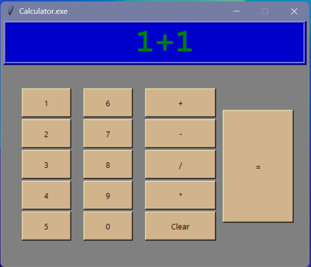

# Old Style Calculator.exe
## Description

**Old Style Calculator.exe** is a standalone, retro-themed calculator built in Python (Tkinter) and packed into an executable for that *vintage Windows XP* look.  
It brings back the classic feel of early 2000s calculators — simple, tan buttons, a blue screen, and green text — the true old-school aesthetic.  

It’s lightweight, fully offline, and gives instant nostalgia without needing Python installed.

## Features

Classic gray interface with tan buttons  
Blue display with green digital numbers  
Basic arithmetic operations: +, -, ×, ÷  
“Clear” button to reset  
Error display for invalid equations  
Compact `.exe` format — no setup required  
No internet, no ads, just pure calculator goodness  

## Screenshot

## Installation

### 1. Download the file

**For Newest Ver Click here 👉 [**Old Style Calculator.exe**](https://github.com/CoolGuy158-Git/Old-Style-Calculator/blob/main/Old%20Style%20Calculator%20V1%20Update%201.4.exe)**

For Oldest Ver Click here 👉 [**Old Style Calculator.exe**](https://github.com/CoolGuy158-Git/Old-Style-Calculator/raw/main/Old%20Style%20Calculator.exe)

For Other Ver Go To Main.

### 2. Run it  
Double-click **Old Style Calculator.exe** to start.  
No installation, no setup.  

### 3. (Optional) Pin to Taskbar  
For quick access, right-click → “Pin to Taskbar” — just like old Windows tools.  

---

## Usage

Use the on-screen buttons to enter numbers and operators.  
Press **=** to calculate, and **Clear** to reset the display.  

### Supported Operations
| Button | Function |
|---------|-----------|
| + | Addition |
| - | Subtraction |
| * | Multiplication |
| / | Division |
| C | Clear display |
| = | Show result |

---

## Notes

- Built in **Python 3 + Tkinter**, compiled with **PyInstaller**  
- Fully portable `.exe` — no Python required  
- Safe to use (no internet access or system edits)   

---

## License

This project is for educational and entertainment purposes.  
You may share or remix it freely, but please keep the original credit.  

> *“Old software never dies, it just gets nostalgic.”* 🧮
> 
> *Update 1.0 removed the Console from opening*
> 
> *Update 1.1 removed maximize*
>
> *update 1.2 makes the ERROR message disapear after 1 sec*
>
> *update 1.3 made it calculate after clicking "=" in keyboard*
>
> *update 1.4 made it calculate after clicking either "=" or "enter".*

